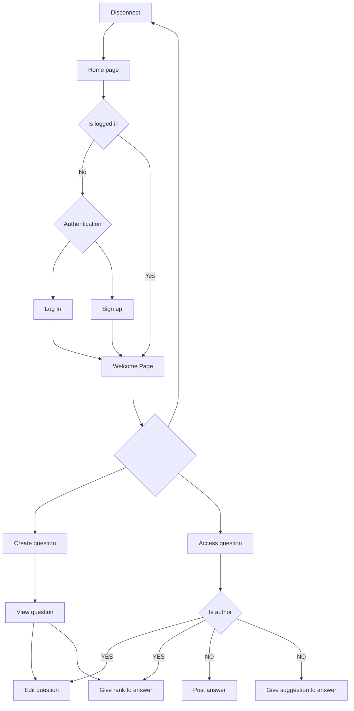

```mermaid
flowchart TB
    A[Home page] --> B{Is logged in}
    B --->|No| C{Authentication}
    C ---> D[Log In]
    C ---> E[Sign up]
    B --->|Yes| F[Welcome Page]
    F ---> G{\n\n\n\n\n\n\n\n}
    D --->F
    E --->F
    G ---> H[Create question]
    G ---> I[Access question]
    H ---> J[View question]
    I ---> 1{Is author}
    1 --->|YES|2[Edit question]
    1 --->|YES|3[Give rank to answer]
    1 --->|NO|4[Post answer]
    1 --->|NO|5[Give suggestion to answer]
    J ---> 2
    J ---> 3
    G ---> 6[Disconnect]
    6 ---> A
```