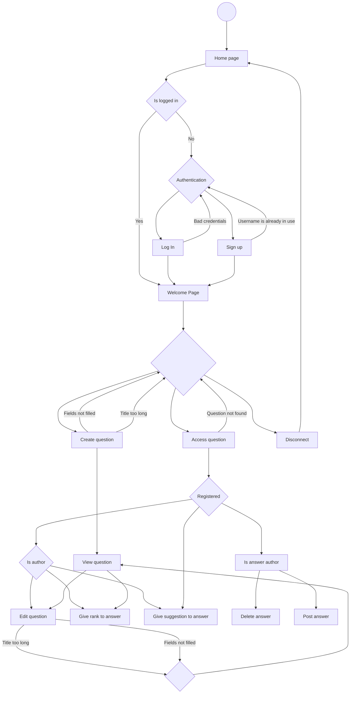

```mermaid
flowchart TB
    0((‎‎ ‎ ‎ ‎ ‎ ‎ ‎ ‎ ‎ ‎ ‎ ‎ )) ---> A
    A[Home page] --> B{Is logged in}
    B --->|No| C{Authentication}
    C ---> D[Log In]
    C ---> E[Sign up]
    B --->|Yes| F[Welcome Page]
    F ---> G{\n\n\n\n\n\n\n\n}
    D --->F
    E --->F
    G ---> H[Create question]
    G ---> I[Access question]
    H ---> J[View question]
    I ---> A9{Registered}
    A9 ---> B1{Is author}
    B1 --->A2[Edit question]
    B1 --->A3[Give rank to answer]
    B1 ---> A5
    A10 ---> A8[Delete answer]
    A9 ---> A10[Is answer author]
    A9 ---> A5[Give suggestion to answer]
    J ---> A2
    J ---> A3
    G ---> A6[Disconnect]
    A6 ---> A
    D --->|Bad credentials|C
    E --->|Username is already in use|C
    I --->|Question not found|G
    H --->|Fields not filled|G
    H --->|Title too long|G
    A2 --->|Title too long|A7{\n\n\n}
    A2 --->|Fields not filled|A7
    A10 ---> A40[Post answer]
    A7 ---> J
```