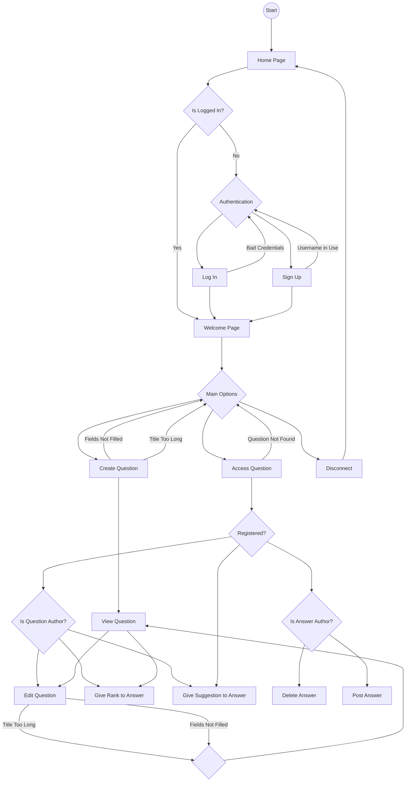

```mermaid
flowchart TB
    A(( Start )) ---> B[Home Page]
    B --> C{Is Logged In?}
    C --->|No| D{Authentication}
    D ---> E[Log In]
    D ---> F[Sign Up]
    C --->|Yes| G[Welcome Page]
    G ---> H{Main Options}
    E ---> G
    F ---> G
    H ---> I[Create Question]
    H ---> J[Access Question]
    I ---> K[View Question]
    J ---> L{Registered?}
    L ---> M{Is Question Author?}
    M ---> N[Edit Question]
    M ---> O[Give Rank to Answer]
    M ---> P[Action Placeholder 1]
    Q[Action Placeholder 2] ---> R[Delete Answer]
    L ---> Q{Is Answer Author?}
    L ---> P[Give Suggestion to Answer]
    K ---> N
    K ---> O
    H ---> S[Disconnect]
    S ---> B
    E --->|Bad Credentials| D
    F --->|Username in Use| D
    J --->|Question Not Found| H
    I --->|Fields Not Filled| H
    I --->|Title Too Long| H
    N --->|Title Too Long| T{\n\n\n}
    N --->|Fields Not Filled| T
    Q ---> U[Post Answer]
    T ---> K
```